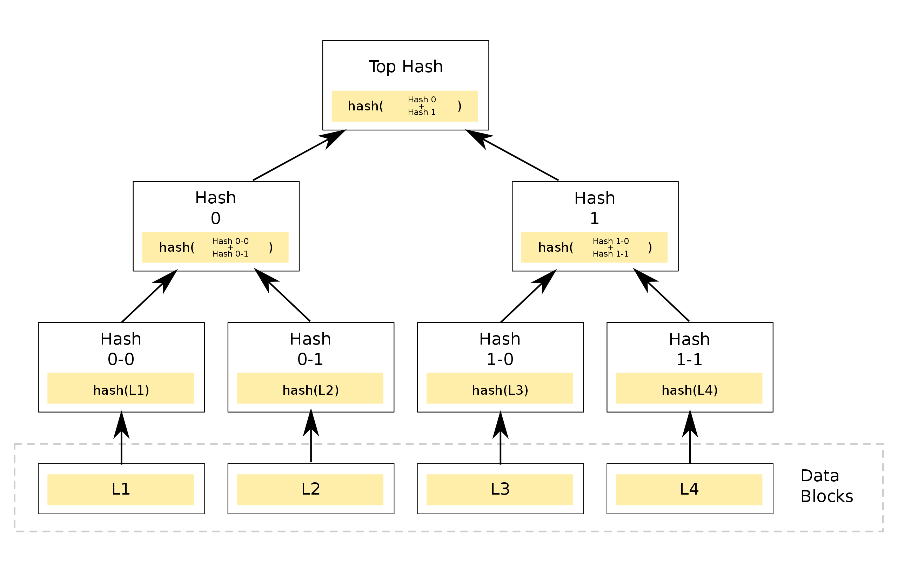

# Merkle Tree

## Description

A Merkle Tree is helpful for obtaining a hash over a large collection of objects. This is used in Bitcoin or other block chain-based algorithms to verify the integrity of a ledger of data blocks. As each data block is added, the even block of each pair is hashed with the prior block. If there are an odd number of nodes, the last of a node layer is duplicated. As you build each new layer, you hash pairs of hashes until you get to the layer with one node. This hash becomes your root hash and it represents the hash of your entire data collection.


Image by Azaghal - Own work, CC0, https://commons.wikimedia.org/w/index.php?curid=18157888

## Build

Build this application with [Go](https://golang.org): `go build`  

## Usage

### Commandline And Output

Separate the input files with a comma. This takes an arbitrary number of arguments up to the operating system limit which varies but typically allows tens of thousands of characters. Only one data block is loaded at a time, and the memory for a layer of the tree is reused for subsequent layers, so 1 GB of RAM should be enough to calculate the root hash of roughly 50,000,000 blocks.

```
$ ./merkle banana.txt
the root hash for this input is ee18f7c45352dce25f086d9ca43e7a57fe8a7301

$ ./merkle carrot1.txt,carrot2.txt,banana.txt
the root hash for this input is d6bb6ab4625851b42864cb55083f203b41329917

$ ./merkle carrot1.txt,not-carrot.txt,banana.txt
the root hash for this input is c70f12bbcd2dedd2195a8787c3bb31f6986fa61b
```

### As a library

```go
package main

import (
	"fmt"
	"github.com/PaluMacil/merkle/merkle"
	"log"
	"os"
	"strings"
)

func main() {
	args := os.Args
	if len(args) != 2 {
		log.Fatalln("please run this command with filenames separated by commas")
	}
	filenames := strings.Split(args[1], ",")
	layer, err := merkle.From(filenames...)
	if err != nil {
		log.Fatalf("starting merkle tree: %s\n", err)
	}
	root := layer.Root()
	fmt.Printf("the root hash for this input is %x", root)
}
```

## Validation

Thirty assertions in the merkle_test package ensure that trees of different dimensions change the root hash with any sort of change to inputs.

## License

This is licensed for use under the conditions contained in the included MIT license.
